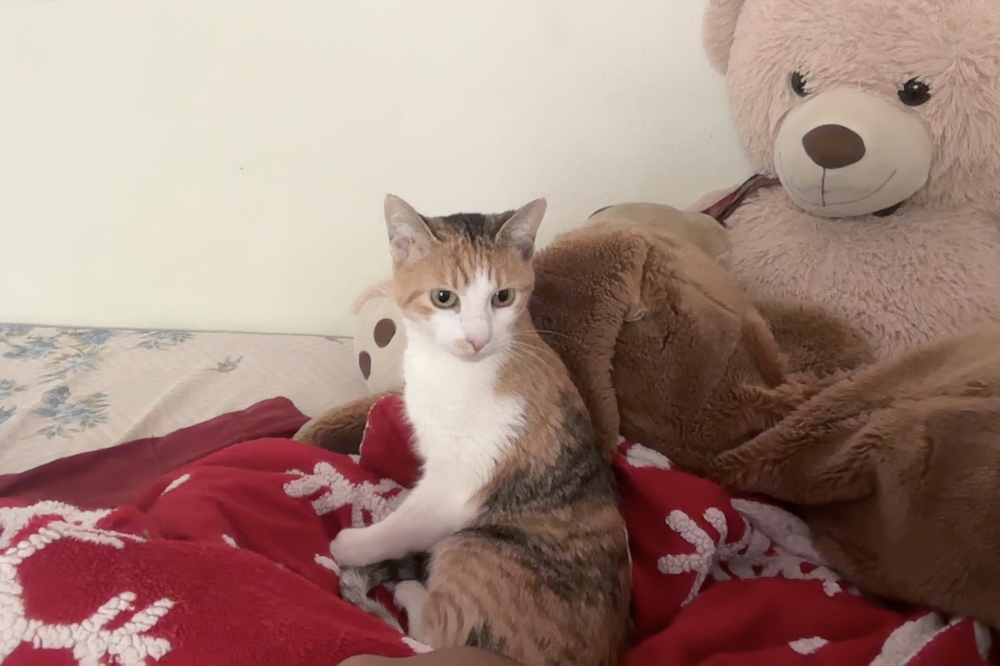
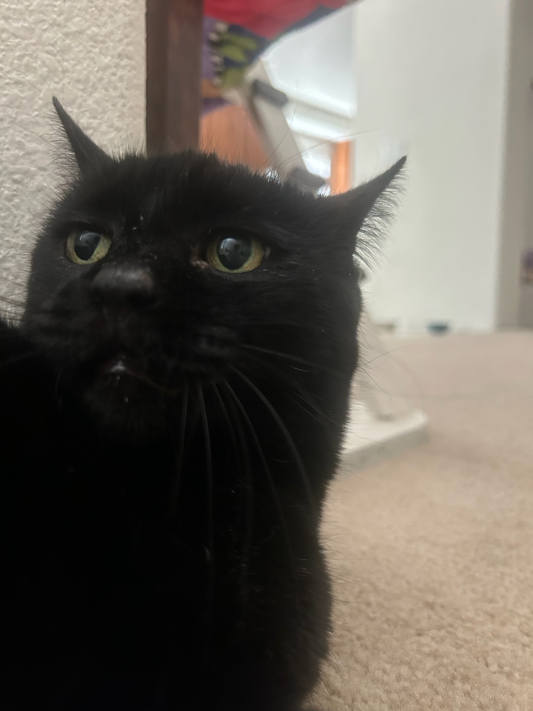

# Nikita Jos

**Second Year Computer Science major**

I am involved in Eta Kappa Nu where I am an officer part of their software team and I am part of the Academic Technology Innovation Team for UCSD ITS

```
System.out.println("Hello, World!");
```

### Links to find me online
> This is my LinkedIn, feel free to connect! [LinkedIn](https://www.linkedin.com/in/nikita-jos/)
> 
> This is my Github, feel free to look around through my projects [Github](https://github.com/nikitajos7)

## A fun fact about me is that I have two cats
### This is my cat Samosa

### This is my cat Toothless


Classes that I am taking this quarter:
- CSE 153
- ENG 100D
- CSE 182
- CSE 132A
- CSE 110

Some of my skills are: 
1. Languages: Java, C, Python, JavaScript, C++, HTML, CSS, SQL, C#, Svelte
2. Technologies: PostgreSQL, Postman, Docker, Spring Boot, SQLite, Jupyter Notebooks, Firebase, Django, Git, Selenium, JUnit, AWS Lambda

Goals:
- [ ] Learn about working with others and have a good bond with my team
- [ ] Apply the skills I learn here into the real world
- [x] Have fun!!!

[This links to the README.md](README.md)

[Go back to the beginning?](#this-is-the-indexmd-file)


